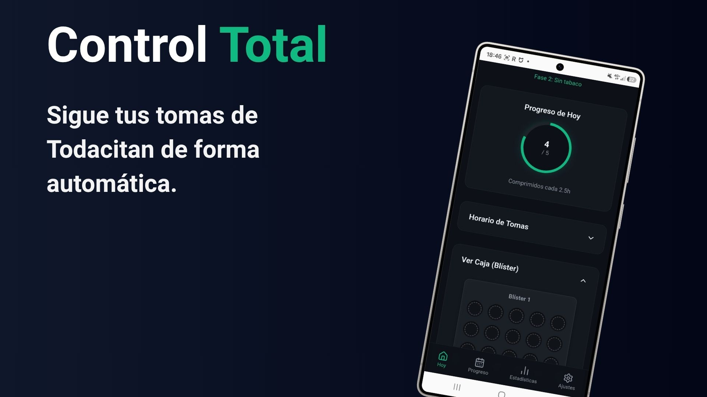
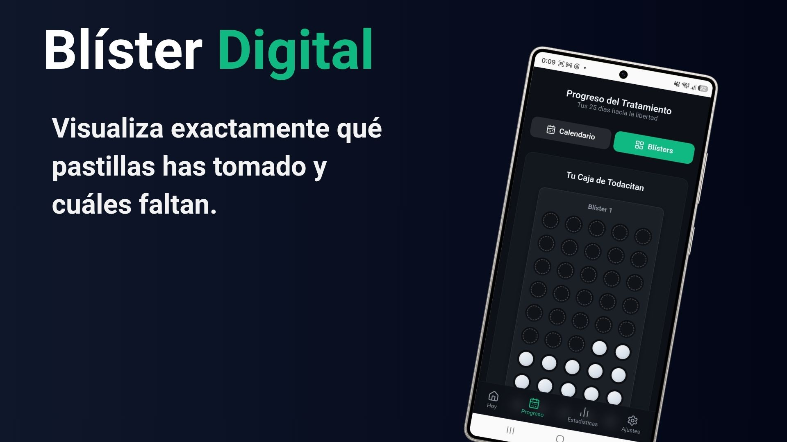
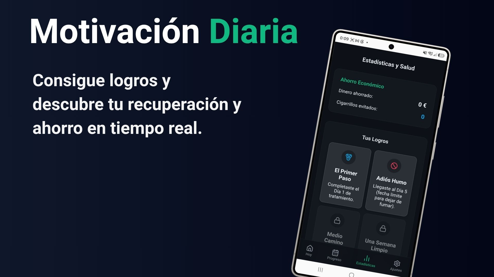

  
  <h1>Todacitracker</h1>
  
<strong>El asistente definitivo para tu tratamiento de 25 días.</strong>

  
  
  
  
  

 

## 📖 Sobre la aplicación

Dejar de fumar con el tratamiento de Todacitan es un gran paso, pero llevar el control estricto de las tomas (que van disminuyendo progresivamente a lo largo de 25 días) puede resultar caótico. 

**Todacitracker** nace como una herramienta móvil gratuita para digitalizar este proceso. Actúa como tu blíster inteligente y tu reloj personal, asegurándose de que nunca te saltes una dosis y manteniendo tu motivación alta.

## 📸 Pantallas

*(Aquí puedes ver cómo luce la interfaz de la aplicación)*

  
  &nbsp;
  
  &nbsp;
  

## ✨ Características Principales

- ⏰ **Alertas Inteligentes:** Notificaciones nativas precisas para cada fase de los 25 días del tratamiento.
- 💊 **Blíster Interactivo:** Controla visualmente las pastillas consumidas y la próxima dosis en una réplica digital de tu caja.
- 📈 **Estadísticas de Salud:** Sigue en tiempo real tu ahorro económico y tu recuperación pulmonar (presión arterial, oxígeno, etc.).
- 🏆 **Sistema de Logros:** Desbloquea medallas según avanzas para mantener la motivación al 100%.
- 🔒 **Privacidad Total:** Funcionamiento 100% offline. Sin cuentas, sin internet, todos los datos se guardan solo en tu dispositivo.

## 📱 Descargar e Instalar

Puedes descargar la última versión lista para instalar en tu teléfono Android de forma gratuita:

1. Ve a la página de **[Releases](../../releases)** de este repositorio.
2. Descarga el archivo `app-release.apk` de la versión más reciente.
3. Ábrelo en tu teléfono Android (acepta el permiso de "Instalar aplicaciones de orígenes desconocidos" si te lo pide).
4. ¡Empieza tu tratamiento!

## ⚖️ Aviso Legal y Médico

Todacitracker es una herramienta de seguimiento independiente creada con fines organizativos y de ayuda comunitaria. **No está afiliada, patrocinada ni respaldada por Aflofarm** (fabricante de Todacitan) ni ninguna otra entidad farmacéutica. 

Esta aplicación **no proporciona asesoramiento médico**. Sigue siempre las indicaciones del prospecto oficial del medicamento y consulta a tu médico o farmacéutico ante cualquier duda sobre tu tratamiento.

## 📄 Licencia
Este proyecto está bajo la licencia [MIT](LICENSE).
